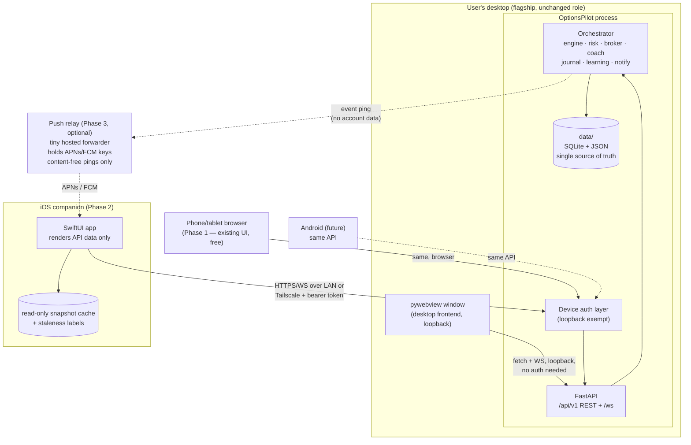

# ARCHITECTURE-MOBILE.md — OptionsPilot Mobile: architecture proposal

**Status: PROPOSAL — not approved, nothing implemented.** This document is
the deliverable of a planning-only session (2026-07-18). No code changes
accompany it. Written against the `v3-ui` branch state (post-V3-7 audit);
the branch's merge to `main` is itself still pending user approval.

**Charter, restated as constraints:**

1. The desktop application remains the flagship, first-class experience —
   permanently.
2. The Python backend is the single source of truth for all business
   logic. No client ever re-implements scoring, gating, risk, coaching,
   or order semantics.
3. Mobile is an excellent *companion*, not a second desktop.
4. Future Android and web clients must fall out of the same design.

---

## 0. The central insight: the separation already exists

The desktop app is a fused client+server: pywebview wraps the same FastAPI
process that `serve` mode exposes, and the entire desktop frontend talks
to it exclusively through `fetch()` on relative URLs plus one WebSocket.
The V3 audit verified there are **zero desktop-only JS APIs** in the
frontend. Architecturally, OptionsPilot is already a client-server system
that happens to ship both halves in one process.

This means the mobile question is *not* "how do we split the app" — it's
"how do we let a second client connect to the server that already
exists." That reframing drives everything below: most of the work is
**contract hardening**, not restructuring.

Two corollaries worth stating because they de-risk everything:

- **A working proto-mobile client already exists**: the current UI served
  by `serve` mode, opened in a phone browser. With V3-1's responsive rail
  it is already usable at phone width. Phase 1 exploits this for free
  end-to-end validation before a line of Swift exists.
- **FastAPI already generates OpenAPI** (`/openapi.json`, `/docs`). The
  machine-readable contract that iOS codegen needs is a byproduct of the
  current stack, not new work — it only needs response models tightened.

---

## 1. Hosting model — Decision #1, everything depends on it

Three options were evaluated:

| Model | Description | Verdict |
|---|---|---|
| **A. Desktop-as-host (companion model)** | The user's desktop app *is* the server. Mobile pairs with it over LAN or a private mesh (Tailscale/WireGuard). | **Recommended** |
| B. Self-hosted headless | Same codebase, `python -m optionspilot serve` on an always-on machine (home server, mini-PC, VPS); desktop and mobile are both clients. | Supported as a natural extension of A — `serve` mode already exists. Not the default because it demotes the desktop app to "a client" and asks the user to run infrastructure. |
| C. Cloud multi-tenant service | Hosted OptionsPilot accounts. | **Rejected for this roadmap.** It changes the product (accounts, tenancy, ops, liability), violates the local-first single-user design, and is the only model that could structurally demote desktop. Revisit only on a deliberate product pivot. |

**Why A:** the single source of truth stays on the user's machine, exactly
where `data/` lives today; the desktop cannot become second-class because
it literally *hosts* the product; zero cloud costs; zero new trust
surface beyond the user's own network; and the paper-trading loop keeps
running where it always has. Model B remains available at any time with
no architectural change — that optionality is itself a feature of A.

**Tradeoffs accepted:** (1) mobile has no live data when the desktop is
off — mitigated by honest offline read-only caching (§13) and, for users
who care, model B on an always-on machine; (2) remote access (outside the
home LAN) needs a network path — the recommendation is Tailscale (or any
WireGuard mesh), which also solves TLS (§4); (3) push notifications
cannot originate from Apple's servers without one small cloud component
(§7) — deferred to Phase 3 and optional forever.

---

## 2. Target architecture diagram

Data flows one way: clients render what the backend computes. No client
holds authoritative state (after the drawings migration, §11.8).

---

## 3. REST API design

**Principles:** resource-oriented; additive evolution; the backend
computes, clients render (the `/api/candles` pattern — indicators are
computed server-side by the same `analysis/` code the engine trades with —
is the template for everything).

- **Prefix:** `/api/v1/...`. The existing unversioned `/api/...` routes
  remain as aliases for the embedded desktop client (which ships in
  lockstep with the server and can migrate at leisure). New external
  clients use only `/api/v1`.
- **Response envelope:** success returns the resource directly (as
  today); errors are normalized to `{"error": {"code": "<slug>",
  "message": "<human>", "detail": {...}}}` with correct HTTP status.
  Today's error shapes are close but not uniform — normalize under v1.
- **Idempotency keys:** every mutating endpoint (orders above all)
  accepts a client-generated `Idempotency-Key` header; the server stores
  recent keys and replays the original response on retry. Mobile networks
  *will* deliver duplicate POSTs; a duplicated paper order is exactly the
  class of bug this project's risk culture exists to prevent.
- **Pagination:** formalize `?limit=&before=<cursor>` on journal, coach
  reviews, and (future) notifications. Additive.
- **Compact summary endpoint:** `GET /api/v1/summary` → `{equity,
  day_pnl, open_positions, unread_notifications, last_scan_ts, market_open,
  halted}` — under 1 KB, designed for background refresh (§8) and widgets.
- **Typed response models:** tighten FastAPI endpoints with pydantic
  response models so `/openapi.json` becomes codegen-grade. This is the
  contract artifact for Swift/Kotlin client generation.
- **Time:** all timestamps ISO-8601 UTC (already the norm — audit for
  stragglers under v1).

**What deliberately does not change:** endpoint semantics. The mobile API
is the desktop API. Any new capability (e.g. server-side drawings) ships
to the desktop client first or simultaneously — the flagship rule applied
to API design.

## 4. Authentication & session management

Single-user system → **device tokens, not accounts.**

- **Pairing flow:** desktop Settings gains a "Devices" card → "Pair a
  device" shows a QR code encoding `{host, port, token}`. The token is a
  256-bit random value, stored **hashed** server-side with a device name,
  created/last-seen timestamps, and a revoke button per device.
- **Requests:** `Authorization: Bearer <token>` on every REST call; WS
  authenticates at handshake. Stateless — no server sessions to manage;
  "session management" reduces to the device registry + revocation.
- **Loopback exemption:** requests from 127.0.0.1 bypass auth, so the
  embedded desktop frontend is completely unaffected. Auth only engages
  when the server is deliberately exposed beyond loopback (a new,
  explicit setting — default off, preserving today's behavior exactly).
- **Transport security:** iOS ATS permits plain-HTTP local networking
  (`NSAllowsLocalNetworking`), and the recommended remote path is
  Tailscale, which provides WireGuard encryption end-to-end without any
  certificate management. Self-managed TLS (mkcert-style local CA) is
  documented as an alternative, not built. App-layer bearer tokens apply
  in all cases — defense in depth.
- Rate limiting and lockout on failed auth attempts (cheap, standard).

## 5. WebSocket architecture

Today: `/ws` pushes the full `status_payload()` at 1 Hz when changed,
heartbeats otherwise. Correct for a desktop on loopback; needs framing —
not replacement — for remote clients.

- **Envelope now:** `{type: "status", v: 1, seq: N, ts, data: {...}}`
  (and `{type: "heartbeat", seq}`). The desktop frontend updates in
  lockstep (one-line change). This is the cheap, do-it-now piece: an
  enveloped protocol can grow; a raw-payload protocol cannot.
- **Client hello (v1):** on connect the client may send
  `{subscribe: ["status"], cadence_ms: 5000}` — mobile asks for a slower
  cadence on cellular; the desktop keeps 1000 ms. Server clamps.
- **Resume semantics:** deliberately stateless. `seq` is per-connection;
  a reconnecting client refetches the REST snapshot then resumes the
  stream. No server-side replay buffer, no missed-message bookkeeping —
  the payload is a full snapshot, so the recovery story is "GET it
  again." Simple beats clever here.
- **Later (only if measurement demands):** topic streams
  (`notifications`, `scan_progress`) and delta payloads. The envelope
  makes both additive. Measured payload sizes today are a few KB —
  probably fine even on cellular; don't build delta machinery on a guess.

## 6. Chart data delivery

Already client-agnostic by design: `/api/candles` returns OHLCV plus
**server-computed** indicator series, with V3-0's `stale`/`as_of`
contract. Any client is a dumb renderer; indicator parity between chart
and engine is structural, not disciplined.

- iOS renders candles natively (Swift Charts or a lightweight canvas
  renderer) *or* embeds the vendored `lightweight-charts` in a WKWebView
  chart module. Decision D6 (§17) — either way, zero math duplicates.
- Additive later: `?since=<ts>` incremental fetch for cellular economy;
  not needed for v1 (payloads are tens of KB).
- The stale-fallback and never-blank-canvas rules from V3-0 become part
  of the client spec: every client must render loading/error/stale states,
  not blank space.

## 7. Push notifications

The one place the self-hosted model meets a hard Apple wall: APNs pushes
must be signed with an Apple key that cannot responsibly ship inside a
desktop app.

- **Phase 2 (no cloud):** no remote push. The iOS app uses background
  refresh (§8) + **local** notifications ("day P/L moved > X%", "new
  coach review since last check") synthesized from `/summary` polls.
  Honest limitation: minutes of latency, iOS-scheduled.
- **Phase 3 (optional, recommended eventually):** a **content-free push
  relay** — a tiny hosted forwarder (single small service) that holds the
  APNs key. The desktop posts `{device_push_token, kind}` — *no account
  data, no P/L, no symbols* — and the relay forwards "something happened"
  pings; the app fetches details from the user's own server on open.
  Privacy-preserving by construction, provider-agnostic (FCM for Android
  later behind the same interface), and skippable forever by users who
  decline it.
- The existing `notify/` NotificationCenter gains a device-push sink
  alongside desktop toast + email — an additive adapter in an existing
  abstraction.

## 8. Background refresh

- iOS `BGAppRefreshTask` polling `GET /api/v1/summary` (sub-1 KB) on
  iOS's schedule (~15-min class, OS-controlled).
- Server cost is trivial (loopback-equivalent read under the existing
  lock-free read paths).
- Widgets/complications (future niceties) consume the same endpoint.
- Failure behavior: silent skip; the app shows last-known data with
  staleness labels (§13) — never an error for a missed background poll.

## 9–12. Synchronization domains

Because the backend is the single source of truth and clients hold no
authoritative state, "synchronization" collapses to **REST reads + WS
snapshot pushes** for nearly every domain. Domain by domain:

| Domain | Server state today | Mobile story | Changes needed |
|---|---|---|---|
| **Portfolio / positions** | Broker + PositionManager, SQLite-backed | Read via status/WS; close via existing risk-gated endpoints + idempotency key | Idempotency only |
| **Paper trading (orders)** | OrderManager, restart-safe | Same ticket flow as desktop; server arbitrates everything | Idempotency only |
| **Watchlist** | `data/settings.json` via RuntimeSettings | Read/edit via existing endpoints | LWW conflict rule (§14); nothing structural |
| **Journal** | SQLite | Read-only on mobile v1 | Pagination cursor |
| **Coach** | SQLite reviews + profile | Read-only on mobile v1 | Pagination cursor |
| **AI scanner** | `last_summary` in status payload; `/api/scan` trigger | Same data; "Scan now" allowed from mobile (it's non-blocking already) | None |
| **Settings** | Runtime overlay server-side; structural config read-only | Trading-mode/operating-mode toggles work as-is; structural config stays read-only everywhere (same as desktop) | None |
| **Chart drawings** | **`localStorage` — client-trapped** (11 uses) | Must move server-side to exist on a second device at all | **The one real migration** (§11.8) |
| **Notifications** | In-memory ring (last 15) in notifier history | Fine for v1; a persistent store is the already-flagged H5 item from `ROADMAP-V3-UX.md` — mobile strengthens its case | H5 (deferred, independent) |

### 11.8 The drawings migration (the one domain that must move)

Chart drawings (levels, trends, fibs, zones, notes) and chart preferences
are user work-product currently trapped in one browser's `localStorage` —
invisible to a second device *and* lost if the WebView profile is reset.
Proposal:

- New `GET/PUT /api/v1/drawings/{symbol}` storing the same JSON shape the
  frontend already uses (per symbol, per-timeframe buckets inside — the
  existing `chDrawKey` format maps 1:1).
- Storage: one small JSON file or SQLite table under `data/`.
- Desktop frontend switches from `localStorage` to the endpoint with a
  one-time transparent import of existing local drawings on first load
  (no user-visible loss).
- Conflict rule: per-symbol last-write-wins with server timestamp —
  drawings are single-user annotations edited on one screen at a time;
  merge machinery would be over-engineering (§14).

This is the only place current architecture actively blocks mobile, and
it is desktop-improving in its own right (drawings survive WebView resets
and appear in `serve`-mode browsers too).

## 13. Offline behavior

Aligned with the project's fail-closed philosophy:

- **Reads:** the app persists the last-known snapshot (summary,
  positions, watchlist, recent journal/coach, cached candles) and renders
  it with explicit staleness labels — the V3-0 stale-banner pattern
  promoted to a cross-client rule. Offline is a *labeled read-only mode*,
  never an error wall and never fake-live data.
- **Writes: none offline.** No queued orders, no queued watchlist edits.
  A paper order queued offline and filled minutes later against different
  prices is a lie about what the user did; the coach would then review
  fiction. Mutations require a live server round trip, exactly like the
  desktop. This is a deliberate product decision, not a limitation to
  engineer away.

## 14. Conflict resolution

Kept deliberately boring — single user, few devices, server arbitrates:

- **Transactional domains** (orders, positions): no conflicts possible —
  the server serializes under the existing orchestrator lock; idempotency
  keys eliminate the duplicate-submit case. First writer wins; second
  gets the truthful current state.
- **Preference domains** (watchlist, runtime settings, drawings):
  last-write-wins on server receipt time, full-object per key (watchlist
  as a whole list op — the existing endpoints are already whole-op;
  drawings per symbol). LWW is correct here because concurrent edits from
  two of the *same user's* devices within one clock skew are vanishingly
  rare and low-stakes; CRDTs/vector clocks would be complexity without a
  user.
- **Rule of thumb going forward:** any new domain must declare which
  bucket it's in before it ships.

## 15. API versioning policy

- `/api/v1` is a **contract**: additive-only (new fields, new endpoints);
  breaking changes require `/api/v2` with a deprecation window.
- The embedded desktop client is exempt from the window (ships in
  lockstep) but migrates to v1 anyway to keep one tested surface.
- The OpenAPI schema is versioned with the app and archived per release —
  the diff between releases *is* the compatibility review.
- WS: `v` field in the envelope; same additive rule.
- Why now: today, server and only-client update atomically, so contract
  discipline is free. The day the first App Store build exists, clients
  lag the server by review cycles and user update habits — the contract
  must be stable *before* that day, because retrofitting versioning onto
  a live external client is the expensive rewrite this document exists to
  avoid.

## 16. Future Android & web compatibility

- **Web:** already exists — `serve` mode's UI *is* a web client. Behind
  device-token auth it becomes a remote web client with zero new code.
  A future dedicated web client (if ever) consumes the same v1 API.
- **Android:** same API, same pairing, same relay (FCM instead of APNs
  behind the same relay interface). Nothing in this design is
  iOS-specific except the app itself and the APNs leg of the relay.
- The design test applied throughout: *"would a third client need any
  server change?"* — target answer: no.

---

## 17. Decisions required BEFORE any iOS development

| # | Decision | Options | Recommendation |
|---|---|---|---|
| D1 | Hosting model | A / B / C (§1) | **A** (desktop-as-host), B documented as supported |
| D2 | Remote transport | Tailscale-recommended / self-managed TLS / LAN-only | **Tailscale-recommended**, LAN works out of the box, TLS documented not built |
| D3 | Push strategy | None (local-only) / content-free relay / full relay | **None in v1; content-free relay in Phase 3**, opt-in forever |
| D4 | iOS client technology | Native SwiftUI / WKWebView wrapper of existing UI / hybrid | **Native SwiftUI** — a wrapper is a phone-browser bookmark with extra steps (and Phase 1 provides that for free); "excellent companion" requires native feel. Hybrid allowed for the chart module only (D6) |
| D5 | Mobile scope charter | Full parity / companion (monitor + act + review; no backtest/learning/settings-editing) | **Companion charter, written down**: dashboard, charts, watchlist, ticket, positions, journal/coach reading, notifications. Backtest, learning internals, and config stay desktop-only — this is the structural guarantee that desktop remains flagship |
| D6 | iOS chart rendering | Native (Swift Charts/custom) / embedded lightweight-charts in WKWebView | Lean **embedded lightweight-charts** (parity + drawings for free, one chart codebase); acceptable to revisit after a spike — the API makes either work |
| D7 | Minimum iOS version | — | Current-minus-one at development start |
| D8 | Contract-hardening timing | Before / after `v3-ui` merge | **After the merge decision**, as its own phase on a fresh branch — don't entangle the pending merge |

## 18. Recommended pre-mobile backend changes (the "do now" list)

All small, all desktop-safe, all additive — and all things that become
expensive after an external client exists:

| Change | Why now | Effort | Desktop migration risk |
|---|---|---|---|
| 1. `/api/v1` aliases + normalized error envelope + typed response models | Contract must exist before any client that can't update in lockstep | ~1–2 sessions | None — old routes alias; desktop moves whenever |
| 2. Idempotency keys on mutating endpoints | Protocol-shaped; retrofitting changes client *and* server later; prevents duplicate paper orders on flaky links | ~1 session incl. tests | None — header is optional; desktop adopts trivially |
| 3. WS envelope (`type/v/seq/data`) + client hello | A raw-payload protocol can't evolve; one-line desktop change now vs. a migration later | ~0.5 session | Lockstep one-liner |
| 4. Device-token auth + pairing UI + loopback exemption (default: not exposed) | Security must precede the first non-loopback listener, and the pairing UX shapes the mobile onboarding | ~2 sessions incl. tests | None — loopback exempt, exposure off by default |
| 5. Server-side drawings (`/api/v1/drawings`) + frontend switch + localStorage import | The one client-trapped data domain; also desktop-improving | ~1–2 sessions | Low — one-time import; verify in browser per project rules |
| 6. `GET /api/v1/summary` | Anchor endpoint for background refresh, widgets, and the Phase-1 phone-browser test | ~0.5 session | None — purely additive |

Total: roughly **6–8 focused sessions**, no PyInstaller/packaging impact,
no trading-logic changes, full suite + browser verification applicable
throughout. Everything else in this document is deliberately deferred
until a real client demands it.

## 19. Phased migration plan

- **Phase 0 — Contract hardening** (the §18 list). Exit: `verify.ps1`
  green, desktop visually unchanged, `/openapi.json` reviewed as a
  contract, drawings server-side.
- **Phase 1 — Remote companion, zero new clients.** Turn on non-loopback
  exposure + auth; pair a phone *browser* via QR; use the existing UI over
  Tailscale for a week of real life. Exit: auth/pairing/transport proven,
  WS behavior on mobile networks measured (informing whether delta/topic
  work is ever needed), UX notes gathered — all before any Swift.
- **Phase 2 — iOS companion v1** (per D5 charter): pairing, dashboard,
  charts (read + drawings view), watchlist, ticket with confirm +
  idempotency, positions, journal/coach reading, local notifications from
  background refresh. Exit: TestFlight on the user's own device.
- **Phase 3 — Push relay (optional):** content-free APNs forwarder,
  desktop "enable remote notifications" opt-in.
- **Phase 4 — Broaden:** Android (same API + FCM leg), dedicated web
  client only if the served UI ever proves insufficient, `?since=`
  incremental candles and topic streams only if Phase 1–2 measurements
  demand them.

Every phase leaves the desktop shippable and unchanged in role; phases
0–1 leave it byte-for-byte identical in behavior for a loopback-only user.

## 20. Risk analysis

| Risk | Likelihood | Impact | Mitigation |
|---|---|---|---|
| Desktop regresses into "just a client" over time | Low if guarded | High (violates charter) | Model A makes desktop the host; D5 charter keeps advanced surfaces desktop-only; flagship rule: every feature ships desktop-first or simultaneously |
| Contract churn after first App Store release | Medium | High | Phase 0 versioning *before* any external client; additive-only policy; archived OpenAPI diffs per release |
| Duplicate/lost orders on mobile networks | Medium | High for trust | Idempotency keys; no offline writes; server-arbitrated truth |
| Apple review friction (finance category) | Medium | Medium (delays) | Paper-trading-only is prominent in-app and in review notes; no real-money capability exists to misrepresent; no account creation to review |
| APNs key/relay becomes an ops burden | Medium | Low (optional feature) | Relay is opt-in, content-free, and skippable; v1 ships without it |
| Exposing the API beyond loopback widens attack surface | Medium | Medium | Off by default; hashed revocable tokens; rate limiting; Tailscale-recommended transport; loopback behavior untouched |
| yfinance load/ToS with more clients | Low | Medium | All clients share one `CachedProvider` on one host — client count barely changes upstream request volume |
| WS payload too heavy for cellular | Low | Low | Measured in Phase 1 before building anything; cadence hint + envelope already allow the fix if needed |
| Drawings migration loses user annotations | Low | Medium (user trust) | One-time import path, verified in browser; localStorage left intact as backup for a release |
| Scope creep: mobile v1 grows toward parity | Medium | Medium | D5 charter is written down and enforced at review time |

## 21. Recommended implementation order (once approved)

1. Resolve the `v3-ui` merge (independent, pending).
2. D1–D8 decisions ratified (this document reviewed/amended).
3. Phase 0 items in §18 order (1 → 6), one commit per item, verified per
   project rules.
4. Phase 1 lived-with for at least a week; measurements written into this
   document.
5. Only then: Phase 2 iOS development begins.

---

*Companion documents: `ARCHITECTURE.md` (current system), `ROADMAP-V3-UX.md`
(the audit that produced V3), `AI_CONTEXT.md` "Future mobile plans" (which
this proposal supersedes if approved — it currently says "none
anticipated" and should be updated to point here).*
