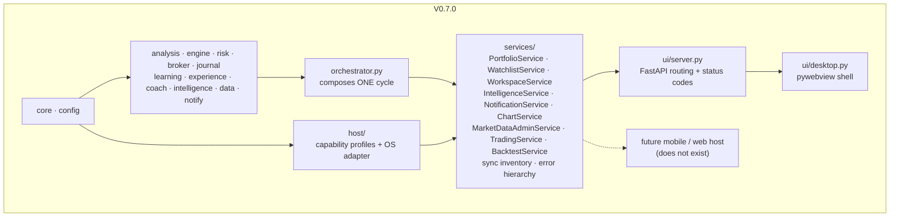

# ARCHITECTURE-PLATFORM.md — the cross-platform architecture (V0.7.0)

**Status: implemented.** This is not a proposal. Everything described in §1–§6
exists in the repository and is enforced by `tests/test_architecture.py`.

Companion documents: `ARCHITECTURE.md` (the system as it runs today),
`ARCHITECTURE-MOBILE.md` (the 2026-07-18 *proposal* for an iOS companion —
still a proposal, and this document is what makes its Phase 0 cheap),
`MODULES.md` (per-module API map), `STORAGE.md` (the on-disk layout).

---

## 0. What this milestone actually did, in one paragraph

OptionsPilot was already a client-server system that happens to ship both halves
in one process. What it did not have was a boundary between *the application*
and *the desktop transport*: `ui/server.py` held FastAPI routing and, in the same
1,700 lines, the decisions about what a client should be shown — which twelve of
thirty-eight metrics are a headline, how a maximum drawdown is computed, what
four buckets a pasted list of tickers falls into. All of it correct; none of it
reachable without importing a web framework. V0.7.0 extracted that into
`optionspilot/services/`, put the OS behind `optionspilot/host/`, moved workspace
state out of one browser's `localStorage`, and classified every durable object
the app owns. **No trading behaviour changed. No UI was redesigned. No test was
removed.**

## 1. The layering, before and after

Before, the `services/` box did not exist and its contents were inside
`ui/server.py`. That is the entire structural change; everything else in this
document follows from it.

**The enforced rules** (`tests/test_architecture.py`, each proven to fail when
deliberately broken):

| Rule | Test |
|---|---|
| `services/` never imports `ui/` | `test_services_never_import_the_ui` |
| `services/` imports no web/GUI framework at all | `test_services_have_no_transport_dependency` |
| `services/` reaches only `data.base`, `data.sessions` and `data.report` — never a provider, a key or a quota | `test_services_reach_only_the_pure_data_helpers` |
| `services/` reaches only `broker.base` and `broker.orders` — **never `broker.registry`**, so no reusable service can construct a live-broker adapter | `test_services_never_reach_a_broker_implementation` |
| `ui/server.py` stays under its line ceiling, and the ceiling stays tight | `test_ui_server_stays_under_its_ceiling`, `test_the_ceiling_is_still_a_ratchet` |
| `host/` stays core-only and transport-free | `test_host_stays_core_only` |
| No `sys.platform` / `os.name` branch outside `core/paths.py`, `host/`, `update/installer.py` | `test_no_module_outside_core_and_host_decides_the_storage_root` |
| No `Path("data")`-style CWD-relative storage path anywhere | `test_no_cwd_relative_storage_paths` |
| Every `AppPaths` file has a declared sync policy | `test_every_appaths_FILE_is_classified` |
| Every declared sync domain has at least one classified object | `test_every_declared_domain_has_at_least_one_entry` |

The second rule is the load-bearing one and it is deliberately stronger than the
first. `services/` could stay free of `optionspilot.ui` and still `import
fastapi` for a response model — at which point a Flutter backend, a CLI, or a
test would be pulling a web server in to compute a win rate.

## 2. The service layer

Each service takes **injected, duck-typed collaborators** and returns **frozen
view models of primitives**. That combination is the concrete answer to *"if
Flutter needed this tomorrow, what interface would it want?"* — it would want
exactly this plus a serializer, and it would need no Python object from any
other package.

| Service | Owns | Was previously |
|---|---|---|
| `PortfolioService` | positions, account, realised performance, P&L windows, setup history | `UIServer.account_metrics`, `_pnl_windows`, `_setup_history`, and the position loop inside `status_payload` |
| `WatchlistService` | parse / validate / add / remove / reorder, and the four-bucket classification | `UIServer.watchlist_*` |
| `IntelligenceService` | the full and summary projections of one snapshot | `ui/server.py::_intelligence_payload`, `_intelligence_summary` |
| `NotificationService` | the event catalogue, severity, push-worthiness, newest-first history | scattered: `notify/` for seven kinds, direct `notifier.history` reads for the UI, polling for everything else |
| `WorkspaceService` | where the user was looking | one browser's `localStorage` |
| `services/sync.py` | the classified inventory of every durable object | nothing — it did not exist |
| `ChartService` (V0.9.2-C2) | the Charts tab's OHLCV + indicator series | `UIServer.candles_payload` |
| `MarketDataAdminService` (V0.9.2-C3) | diagnostics, the text report, replay, the twelve control-centre calls | `UIServer.marketdata_*` |
| `TradingService` (V0.9.2-C4) | the manual order path, the option chain, account metrics, the scan cycle | `UIServer.place_order`, `chain_payload`, `run_cycle_now` and the scan state |
| `BacktestService` (V0.9.2-C5) | the single job slot: claim, parameters, report writing, `backtest_job` | `UIServer.start_backtest`, `_run_backtest` and the `_bt_*` state |

`ServiceRegistry` is the one place these are wired. Its constructor signature is
the honest statement of *what a second client's backend must provide*: an
orchestrator, a runtime settings store, a config, a lock, a symbol directory, and
three callables. Everything else is derived.

**What the layer deliberately does not do:** it does not own the cycle
(`orchestrator.run_cycle()` is still the only composition of engine + risk +
broker + coach + notify), it does not gate trades (`RiskManager` is still the
only entry gate, `OrderManager` still the only execution path), and it persists
nothing itself.

### 2.1 View models

`services/viewmodels.py`. Frozen dataclasses of primitives with one `to_dict()`
serialisation boundary. Frozen because a view model handed to two renderers that
both mutate it is the *two objects tracking one fact* failure this codebase has
paid for three times (`data/health.py` V0.5.3, the settings ranking V0.5.7, the
guide catalogue V0.6.1); freezing makes the second mutation a crash instead of a
drift.

A view model computes nothing. Rounding and *None instead of infinity* are
presentation; a win rate is not.

## 3. The host layer

`optionspilot/host/` is split into two different kinds of thing.

**`capabilities.py` is data.** A `HostProfile` per target — `desktop`,
`headless`, `web`, `ios`, `android` — listing which of thirteen `Capability`
values it has, and carrying a *reason* for every notable absence. Three of those
targets do not exist and are marked `implemented=False`; they are here because
the point of the milestone is to be ready for them, and a profile that records
`ios: SELF_UPDATE = False` is what stops a future session wiring the auto-updater
into a mobile build and discovering App Store policy the hard way.

The single most load-bearing entry: **neither mobile target has
`BIND_LISTENER`.** The desktop-as-host model, the single-writer paper account,
and the companion charter all follow from that one fact, and
`tests/test_host.py::test_mobile_targets_cannot_host` asserts it.

**`adapter.py` is behaviour.** `HostAdapter` is the runtime interface: durable
storage root, temp space, opening a URL, the single-instance lock (moved here
from `ui/desktop.py`). `DesktopHost` is byte-for-byte what V0.6.1 shipped —
the same socket bound to the same port 8786, the same `AppPaths`. `set_host()`
is the seam a test or a future mobile backend uses.

The rule that makes it worth having: **a business-logic module may ask a
capability question, never an `sys.platform` question.** `if not
host.supports(Capability.TOAST)` survives a port; `if sys.platform == "win32"`
is a bug on every platform that is not Windows, and a silent one on most.

## 4. The workspace

`GET/POST/DELETE /api/workspace`, backed by `services/workspace.py`, persisted
through `RuntimeSettings` into `settings.json` under a `workspace` key.

**Why it moved.** Selected symbol, timeframe, indicator set, extended hours,
auto-follow, watchlist sort and the ticket chart's state all lived only in
`localStorage`. That has two consequences and the second matters more. A second
client cannot see any of it — a phone opening the same account starts on SPY 1d
regardless of what the desktop is showing. And `localStorage` is not durable
storage: clearing the WebView2 profile, restoring a backup or reinstalling
discards it silently. That is exactly the failure V0.6.1 refused to accept for
onboarding progress, for exactly the same reason, and workspace state had it all
along.

**The design is additive, and the ordering is the reason.** `CH.sym`, `CH.tf`,
`wlSort` and `tkChartOpen` are read at *script-eval* time, long before any fetch
resolves. Making the server the synchronous source would mean restructuring
chart initialisation around an `await`, in a 7,900-line file with no automated
per-flow coverage. So `localStorage` stays the fast local path and the server
becomes the **durable** one:

* every local write is mirrored up, debounced at 600 ms, through a single
  `Storage.prototype.setItem` interception (one point that cannot miss a write
  and cannot change what a write already does);
* a profile with **no** workspace keys at all — a fresh install, a cleared
  profile, a restored backup — adopts the server's copy instead of the shipped
  defaults.

`scripts/workspace_check.py` (21 checks, wired into `verify.ps1`) proves the
claim the way it has to be proven: wipe `localStorage` in a real browser, reload,
and assert the symbol and timeframe **on screen** are the ones chosen before the
wipe.

The service itself is pure and shape-validating, modelled on `services/guide.py`. It
holds no second catalogue: `tab` and indicator names are frontend vocabulary and
are checked for type and length only, because a Python copy of them would be the
two-catalogue drift the guide layer exists to avoid. `timeframe` **is** validated,
against `core.models.Timeframe`, because that value is handed straight back to
`/api/candles`.

## 5. Notifications

`services/notifications.py` holds the catalogue: thirteen kinds, each with a
severity, a plain-English "when it fires", and a `pushable` flag.

`pushable` is deliberately **orthogonal to severity**. `provider_offline` is
important and belongs in the app; pushing it to a phone at 3am teaches the user
to switch notifications off entirely — which costs them the `risk_limit` alert
too. A catalogue is what lets a future push sink make that judgement without
knowing what a CHoCH invalidation is.

Six of the thirteen kinds are new — `goal_achieved`, `lesson_unlocked`,
`ai_recommendation`, `provider_offline`, `update_available`,
`tutorial_recommended`. They describe events V0.6.0/V0.6.1 already produced and
which could previously only be discovered by *polling* whichever screen computed
them.

**What this is not:** a store. History is still the `NotificationCenter`'s
in-memory ring of 200. A durable notification store is a real gap — a restart
loses unread items, and a phone that was asleep cannot catch up — and it is
listed as a remaining blocker in §7 rather than quietly half-built.

## 6. Synchronization boundaries

`services/sync.py`. **Nothing here syncs anything.** V0.7.0 builds no cloud sync,
no accounts, no replication. It builds the inventory that has to exist first.

The expensive part of synchronization is never the transport; it is discovering
in production, usually as data loss, that two objects you assumed independent
share a key, or that a file you replicated for convenience contained a secret, or
that last-write-wins was silently applied to an append-only log. Every one of
those is a classification question, and every one is answerable today from a
codebase that has exactly one device and therefore cannot yet be wrong.

Each of the 20 entries carries a `SyncDomain` (what kind of user fact) and a
`SyncPolicy` (what a second writer would mean):

| Policy | Meaning | Examples |
|---|---|---|
| `NEVER` | A defect if it leaves the device, regardless of transport | `data/credentials.json` — the only one |
| `SINGLE_WRITER` | Mutual exclusion, not a merge strategy | `paper.db`, `orders.db`, the in-flight trade state |
| `APPEND_ONLY` | Disjoint records union cleanly; an overwrite destroys history | `journal.db`, `experience.db`, `coach/*.json` |
| `LAST_WRITE_WINS` | Small, whole-object, single-user | `settings.json`, `marketdata.json`, goals, weights |
| `DEVICE_ONLY` | Regenerable or machine-specific | `cache.db`, `quota.json`, logs, backups, reports |

Two entries are worth reading in full in the source. `data/quota.json` *looks*
shared — the quota belongs to the API key, not the machine — and is still
device-only, because replicating a counter across devices with clock skew
produces a budget wrong in both directions. And `backups/` is device-only partly
because a backup living on the same service as the thing it protects is not a
backup, and partly because it contains `credentials.json` by construction, which
makes replicating it a `NEVER` violation by another route.

`GET /api/diagnostics/sync` exposes the whole inventory. It contains no user data
and no secret, so it is safe in a public bug report.

## 7. Remaining platform blockers, honestly

These are the things that still stand between this repository and a working
second client. None is hidden in a footnote elsewhere.

1. **Chart drawings are still client-trapped.** Levels, trends, fibs, zones and
   notes live in `localStorage` under `chDraw:<symbol>`, versioned
   `{version:3, items:[…]}`. They are user *work-product*, not a preference,
   and moving them needs a real one-time import path and a migration — shipping
   half of that would risk the annotations it is meant to protect. Recorded in
   `services/sync.CLIENT_TRAPPED`.
2. **No API versioning, no error envelope, no idempotency keys.** The `/api/v1`
   prefix, the normalized `{"error": {...}}` shape and `Idempotency-Key` on
   mutating endpoints are all still `ARCHITECTURE-MOBILE.md` §18 items. They stay
   cheap only while server and client update in lockstep.
3. **No authentication of any kind.** The server binds loopback only. A device
   token layer with a loopback exemption must precede the first non-loopback
   listener.
4. **The WebSocket payload is unenveloped.** `/ws` still pushes a raw
   `status_payload()`. A raw-payload protocol cannot evolve; the `{type, v, seq,
   data}` envelope is a one-line desktop change now and a migration later.
5. **Notifications have no durable store.** §5.
6. **The tab is restored only on adoption, not on every launch.** Deliberate:
   making every launch resume the last tab would change how the desktop app
   behaves, and this milestone is explicitly not that. Asserted in
   `workspace_check.py` so it stays a decision rather than becoming a surprise.
7. **`tkChartOpen` is seeded but not applied live.** On adoption it takes effect
   at the *next* launch, because forcing the ticket's chart open post-eval would
   desync the panel from its own toggle.
8. **`sidebar_collapsed` has no frontend source.** The field exists in the
   workspace model (it is in the V0.7.0 charter's list) and nothing writes it,
   because the desktop sidebar has no collapse control today.
9. **`notify/desktop.py` is Windows-only in practice.** It degrades to log-only
   elsewhere, which is correct behaviour, but the *host* should be the thing
   saying "no toast here" rather than the notifier discovering it by failing to
   import `windows_toasts`.

## 8. Cross-platform readiness

An honest scorecard of what a second client would still have to be given. "Ready"
means the work is done; "partial" means the boundary exists but the transport
work does not; "blocked" means something must be built first.

| Concern | State | Note |
|---|---|---|
| Business logic reachable without a UI | **Ready** | `services/` + `ServiceRegistry`, enforced |
| View models free of domain objects | **Ready** | frozen primitives, one `to_dict()` |
| OS access behind an interface | **Ready** | `host/`, enforced |
| Capability profiles for every target | **Ready** | data, with reasons, tested |
| Workspace portable | **Ready** | server-owned, browser-proven |
| Notification routing | **Ready** | catalogue + severity + pushability |
| Persisted-object classification | **Ready** | 20 entries + 2 client-trapped, enforced |
| Storage-root portability | **Ready** | `AppPaths` already covers win/mac/linux |
| REST contract stability | **Partial** | unversioned, unenveloped errors |
| WebSocket protocol | **Partial** | works; cannot evolve |
| Authentication | **Blocked** | none exists; loopback-only today |
| Chart drawings | **Blocked** | client-trapped, needs a migration |
| Push delivery | **Blocked** | needs a relay; §5 of `ARCHITECTURE-MOBILE.md` |

The honest summary: **the application layer is ready and the transport layer is
not.** That is the right order — the transport items are each about one session's
work and none of them requires touching business logic, whereas the extraction
this milestone did would have become progressively more expensive with every
feature added on top of the old shape.

## 9. Performance impact

Measured, not assumed: the full suite ran 103.4s at baseline (1,908 tests) and
109.3s after (2,026 tests) — the delta is the 118 new tests, not a slowdown.

The extraction is a call-depth change, not an algorithmic one. Every moved
computation runs the same arithmetic over the same inputs under the same lock;
`PortfolioService` reproduces exactly which reads happen inside the orchestrator
lock and which do not, because widening it would let a statistics pass block a
scan.

The one genuinely new cost is the workspace mirror: one debounced POST per
interaction burst, writing `settings.json` — the same file and the same
`_save()` the watchlist and trading mode already use. The 600 ms debounce exists
so that toggling four indicators is one write rather than four.
