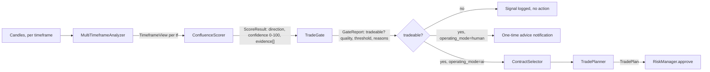
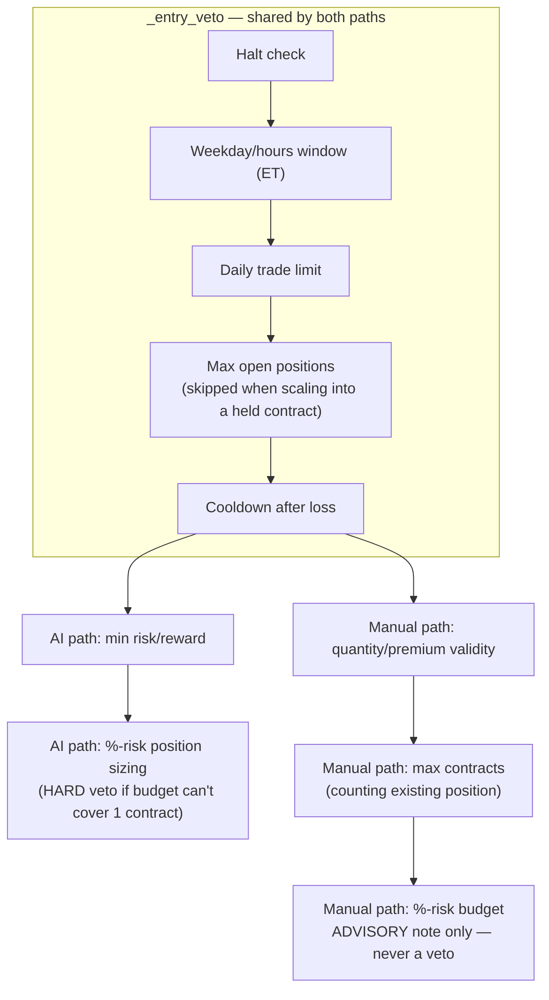
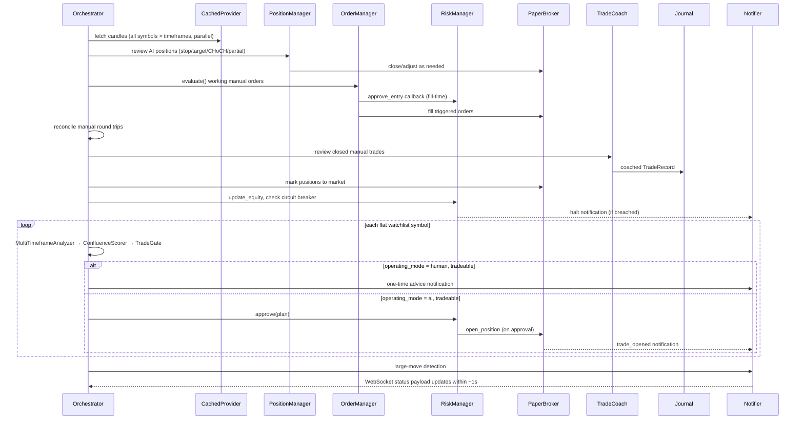
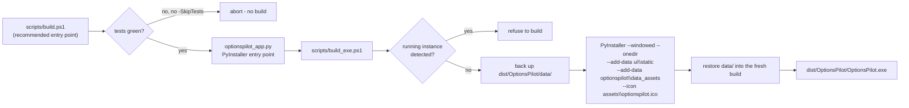

# OptionsPilot — System Architecture

**Status:** Living document. Updated as each phase lands.
**Mode:** Paper trading only. Live trading is architecturally possible but gated behind
configuration (`broker.live_trading_enabled`) that defaults to `false` and requires an
explicit, multi-step opt-in that does not exist anywhere in this codebase — there is no
live-broker implementation to enable even if the flags are set.

For orientation on *why* things are built this way (vision, philosophy, things not to
touch casually), see `AI_CONTEXT.md`. This file is the *how* — the shape of the system.

---

## 1. Design Principles

1. **Safety first.** No code path can place a real-money order. The only broker
   implementation is a simulator. Live adapters, when added, sit behind the same
   `Broker` interface and a hard config gate re-checked at construction time.
2. **Everything is a module behind an interface.** Data providers, brokers, strategies,
   indicators, and notifiers are all pluggable. Swapping yfinance for Polygon, or the
   paper broker for Alpaca, touches one adapter file and one config line.
3. **The same analysis code runs live and in backtests.** The AI engine consumes a
   stream of candles; it does not know whether they come from the live data engine or
   the backtester. This eliminates the classic "backtest says X, live does Y" bug class.
4. **Deterministic and auditable.** Every decision is logged with its inputs. Every
   trade records the full reasoning chain. The AI coach is deterministic too — built
   entirely on the existing analysis engine, not an external LLM call.
5. **Fail closed.** Any error in risk checks, data quality, or broker communication
   halts trading rather than guessing.
6. **Two independent mode axes, never conflated.** `operating_mode` (who places
   entries: AI vs. the human user) and `trading_mode` (how the confidence threshold
   behaves: conservative/high-risk/custom) are orthogonal. Switching one must never
   change the other — enforced explicitly in `RuntimeSettings._apply_mode`.

---

## 2. Directory Structure

```
optionspilot/
├── config.yaml                  # structural, startup-only config (user-editable)
├── pyproject.toml                # deps, package-data, pytest config
├── CLAUDE.md                     # permanent AI-agent instructions (read first)
├── README.md                     # user-facing overview + setup
├── optionspilot_app.py           # PyInstaller entry point (exe launches here)
├── OptionsPilot.spec             # PyInstaller build spec (gitignored, regenerated)
│
├── optionspilot/                 # the package
│   ├── __main__.py                #   CLI: run/ui/serve/scan/status/journal/backtest/learn
│   ├── orchestrator.py            #   the one event loop; composes every subsystem
│   ├── config/                    #   settings.py (pydantic, startup) + runtime.py (live overlay)
│   ├── core/                      #   domain models (dataclasses), logging setup
│   ├── data/                      #   MarketDataProvider ABC, yfinance adapter, caching, symbols
│   ├── analysis/                  #   PURE FUNCTIONS: indicators, patterns, structure, SMC, options math
│   ├── engine/                    #   MultiTimeframeAnalyzer → ConfluenceScorer → TradeGate → planner
│   ├── risk/                      #   RiskManager — the only path to the broker
│   ├── broker/                    #   PaperBroker, OrderManager, PositionManager, registry (live stubs)
│   ├── coach/                     #   TradeCoach (process-scored review) + CoachProfile (aggregation)
│   ├── journal/                   #   SQLite trade record store
│   ├── learning/                  #   evidence-weight tuning from journal history
│   ├── backtest/                  #   event-driven replay through the SAME engine/risk/broker
│   ├── notify/                    #   desktop toast + email notifications
│   ├── integrations/              #   TradingView webhook parsing (inbound alert only)
│   ├── ui/                        #   FastAPI app (server.py), pywebview shell (desktop.py)
│   │   └── static/                #     index.html (entire frontend) + vendored lightweight-charts.js
│   └── data_assets/                #   bundled 12k-symbol CSV (generated, don't hand-edit)
│
├── tests/                        # one test file per module, pytest, 345 tests
├── scripts/                      # build_exe.ps1, soak.py, make_icon.py, fetch_symbols.py
├── docs/                         # this document set
├── assets/                       # generated app icon
├── data/                         # gitignored — the user's real paper account, journal, logs
└── logs/                         # gitignored — rotating per-subsystem logs
```

Layering rule (enforced by convention, not by tooling): each layer only depends on
layers below it. `analysis/` has no dependents below `engine/`; `engine/` doesn't
import `broker/`; `broker/` doesn't import `ui/`. If a change requires importing
"up" the stack, that's a signal the code belongs somewhere else.

---

## 3. Backend Architecture

```mermaid
graph TB
    subgraph UI["UI Layer"]
        WV[pywebview desktop window]
        API[FastAPI app / server.py]
        WS[WebSocket /ws]
    end

    subgraph Core["Orchestrator (orchestrator.py)"]
        ORCH[Orchestrator.run_cycle]
    end

    DATA[Data Engine<br/>CachedProvider → YFinanceProvider]
    ENGINE[AI Decision Engine<br/>Analyzer → Scorer → Gate → Selector → Planner]
    RISK[Risk Manager<br/>the only path to the broker]
    BROKER[Broker Layer<br/>PaperBroker + PositionManager]
    ORDERS[Order Manager<br/>manual working orders]
    COACH[Trade Coach<br/>process-scored review]
    JOURNAL[Journal + Learning]
    NOTIFY[Notifier]
    BACKTEST[Backtester<br/>drives the AI Engine offline]

    WV --> API
    API --> WS
    API -->|UIServer.lock| ORCH

    ORCH --> DATA
    ORCH --> ENGINE
    ORCH --> RISK
    ORCH --> BROKER
    ORCH --> ORDERS
    ORCH --> COACH
    ORCH --> JOURNAL
    ORCH --> NOTIFY

    ENGINE --> RISK
    RISK --> BROKER
    ORDERS --> RISK
    BACKTEST -.->|same code, historical candles| ENGINE
    BACKTEST -.-> RISK
    BACKTEST -.-> BROKER

    style RISK fill:#4a1a1a,stroke:#ff5252
    style BROKER fill:#1a2a4a,stroke:#3d8bff
```



The `Orchestrator` is the only class that composes engine + risk + broker + coach +
notify into a cycle. The UI never calls broker methods directly to open a position —
it either calls into the orchestrator or a narrowly-scoped public method the
orchestrator exposes for exactly that purpose (see `register_manual_entry`,
`approve_manual_entry`).

### 3.1 Data Engine (`optionspilot/data/`)
- `MarketDataProvider` (abstract): `get_candles(symbol, timeframe, start, end)`,
  `get_quote(symbol)`, `get_option_chain(symbol, expiration)`.
- `YFinanceProvider`: free provider used in v1. Delayed/EOD-quality data — fine for
  paper trading and backtesting. Rate-limited (0.15s between requests).
- `CachedProvider`: the caching/deduplicating layer the orchestrator wraps around
  the real provider — timeframe-aware candle TTLs, short quote/chain/expiration
  memos, in-flight request dedup, SQLite write-through for warm restarts. This is
  why a manual "Scan now" right after a cycle completes in ~0.1s.
- `CandleCache`: SQLite-backed cache so backtests and repeated scans don't
  re-download. Thread-safe (single locked connection,
  `check_same_thread=False`) because in serve/desktop mode every candle
  fetch runs on a ThreadPoolExecutor worker or FastAPI threadpool thread —
  see `CHANGELOG.md` V3-7 for the bug this fixed. Since V3-0 it also backs
  `CachedProvider.get_candles_stale_ok()`, the Charts tab's display-only
  fallback (any-age disk bars, flagged stale) when the live fetch fails;
  the strict `get_candles` path the engine uses never serves stale data.
- `symbols.py` + bundled `optionspilot/data_assets/symbols.csv` (12,472 NASDAQ/NYSE tickers):
  offline ticker validation and autocomplete search for the watchlist manager.
- `presets.py`: static preset watchlists (Magnificent 7, S&P 500 Leaders, etc.).
- Future adapters: Polygon, Tradier (market data), Alpaca, TradingView webhooks
  (as an *alert input*, since TradingView has no data/trading API).

### 3.2 Analysis Library (`optionspilot/analysis/`)
Pure, stateless functions over pandas DataFrames. No I/O, no side effects — fully
unit-testable and reused verbatim by the live engine, the backtester, AND the trade
coach (see 3.9). This sharing is what guarantees live/backtest parity and lets the
coach reason about a manual trade with the exact same lenses the AI trades with.
- `indicators.py` — EMA, SMA, VWAP, MACD, RSI, Stoch RSI, ATR, Bollinger, Supertrend,
  ADX, OBV, relative volume.
- `candlesticks.py` — engulfing, hammer, shooting star, doji, morning/evening star,
  inside/outside bars, marubozu, three white soldiers / three black crows.
- `structure.py` — swing highs/lows, HH/HL/LH/LL classification, BOS, CHoCH,
  consolidation detection, trend state.
- `smart_money.py` — fair value gaps, order blocks, liquidity pools (equal highs/lows),
  liquidity grabs, premium/discount zones, supply/demand. Vectorized with numpy.
- `volume.py` — volume spikes, buying/selling pressure, volume divergence.
- `options_metrics.py` — Black-Scholes greeks, IV solving, liquidity scoring
  (spread %, OI, volume), expected move.

---

## 4. AI Engine (`optionspilot/engine/`)



- `MultiTimeframeAnalyzer`: runs the analysis library across configured timeframes
  (e.g. 1D/4H/1H/15m/5m), producing a `TimeframeView` per timeframe. Capped to the
  trailing 400 bars per timeframe to bound per-scan cost. Views are memoized per
  (symbol, timeframe) on a data fingerprint — unchanged frames skip the entire
  indicator/pattern/smart-money rebuild.
- `ConfluenceScorer`: weighted scoring of 15 evidence signals (trend alignment,
  structure, patterns, volume, momentum, SMC signals) → confidence score 0–100 with an
  itemized reason list. Weights come from config and are later tuned by the learning
  system.
- `TradeGate`: decides tradeability from the score. **Conservative** mode: fixed
  `min_confidence` bar. **High-Risk** mode: the bar adapts to a deterministic *setup
  quality* classification (excellent/good/average/poor) — poor setups never trade at
  any confidence; sub-conservative-bar entries additionally require a stretched
  risk/reward. **Custom** mode: user-set fixed thresholds, validated through the same
  pydantic models as `config.yaml`. Every verdict is a `GateReport` (quality, threshold
  used, passed/failed confirmations, one-line reason).
- `ContractSelector`: given a directional signal, scans the option chain and picks
  the contract by delta target, DTE window, liquidity score, and spread threshold.
  Rejects illiquid chains outright.
- `TradePlanner`: builds a full `TradePlan` — entry, stop (structure/ATR based),
  targets, partial-profit levels, max hold time, invalidation conditions.
- `DecisionEngine`: the facade that composes the above; `evaluate()` always runs
  (even in Human Mode — it's what the AI's "advice" is built from), `build_plan()`
  only matters when something is actually going to trade.

---

## 5. Risk Management (`optionspilot/risk/`)



`RiskManager` is the only path to the broker for entries — neither the AI engine nor
a manual order can reach `open_position`/`open_manual` without passing through it.
Exits are never risk-gated — a stop must always be honorable regardless of the daily
loss limit.

- `approve(plan, open_positions, now)` — the AI path. Enforces every entry gate, then
  the engine's %-risk position sizing (`equity · risk% / min(premium·100, |delta|·
  stop_distance·100·1.25)`, capped at `max_contracts`) as a hard veto if the budget
  can't cover even one contract.
- `approve_manual_entry(quantity, premium, open_positions, now, *, is_new_position,
  existing_quantity)` — the Human Mode path. Shares every hard gate the AI path has
  (halt, hours, daily trade limit, max open positions, cooldown, max contracts). The
  %-risk sizing is **deliberately advisory only here** — computed and surfaced in
  `RiskDecision.notes`, never a veto. Sizing a user-directed trade is the user's call;
  oversizing is the coach's job to flag (the `oversized` mistake tag), not the risk
  manager's to block. Wired from `UIServer.place_order` (immediate market buys, 422
  on veto) and `OrderManager.evaluate`'s fill-time `approve_entry` callback (delayed
  limit/stop fills).
- Circuit breaker: daily loss limit & max consecutive losses → halted until the next
  ET day; weekly loss limit → halted until next ET Monday; max drawdown → halted
  until a human calls `reset_halt()`. All three share `_halt_reason`/`_halt_until`
  state, surfaced to the UI as a banner and to the orchestrator as a notification.

---

## 6. Broker Layer / Paper Trading Engine (`optionspilot/broker/`)

- `Broker` (abstract): `open_position`, `close_position`, `get_positions`,
  `get_account`, mark-to-market.
- `PaperBroker`: full simulator — realistic fills using bid/ask with configurable
  slippage, commissions, and partial fills; tracks account equity, positions, P&L.
  Persists state to SQLite (`data/paper.db`) so the paper account survives restarts.
  Two entry paths: `open_position()` (AI, takes a `TradePlan`) and `open_manual()`
  (Human Mode, no plan). Every `Position` carries `managed_by: "ai" | "manual"` —
  this field is the load-bearing distinction between the two modes' exit ownership.
- `PositionManager`: manages AI-owned positions' exits each cycle (stop/target/
  CHoCH-invalidation/partial). **Explicitly ignores `managed_by="manual"` positions**
  — those are the `OrderManager`'s job, never the AI's.
- `OrderManager` (`orders.py`, new in V2-2): the manual working-order book. MARKET
  (immediate), LIMIT (option premium), STOP_LOSS / TAKE_PROFIT / TRAILING_STOP
  (underlying price levels, direction-mirrored for puts), DAY (expires 16:00 ET) /
  GTC time-in-force. Evaluated once per scan cycle against fresh quotes — no
  intrabar simulation (documented limitation of delayed data). Reservation checks
  prevent overselling a position across multiple bracket orders; sell orders
  auto-cancel if the position closes first; fully persisted and restart-safe
  (`data/orders.db`).
- `registry.py`: `create_broker()` factory. `AlpacaBroker`/`TradierBroker`/
  `WebullBroker`/`IBKRBroker` are named extension slots that raise `BrokerError`
  with guidance — no live-order code exists yet anywhere. Live adapters, when
  built, refuse to initialize unless `broker.live_trading_enabled: true` AND
  `broker.i_understand_the_risks: true` (checked at construction, defense in depth
  even though nothing currently implements either flag's true path).

---

## 7. Trade Coach (`optionspilot/coach/`, new in V2-3)

- `TradeCoach.review()`: takes one closed `TradeRecord` (manual trades only — AI
  trades are tuned by the learning system instead, see §8) plus entry/exit context
  snapshots and the contract's order history, and produces a `CoachReview`:
  before-the-trade findings (setup quality agreement, trend confirmation, chased-entry
  detection, volume/DTE/IV/delta sanity, position sizing, opening-chop timing,
  revenge-trade detection), during-the-trade findings (stop placed? moved against the
  position? averaged down?), after-the-trade analysis (why it won/lost, held-loser /
  cut-winner-early detection), a 14-tag mistake taxonomy (each tag carries a
  professional-comparison note and a concrete practice exercise), and a **process-based
  score 0–100** — this is a deliberate design choice: a disciplined stopped-out loss
  scores well, a reckless lucky win scores poorly, because the coach is teaching
  process, not celebrating outcomes.
- `CoachProfile.build()`: aggregates every persisted review (`data/coach/*.json`) into
  recurring mistakes ranked by frequency, top strengths, a score trend over time
  (improving/declining), win rate sliced by setup quality, and the top-3 recommended
  exercises. Rebuilt fresh from disk on every call — never drifts from evidence.
- Reviews are triggered by the orchestrator's manual-trade reconciliation loop (see
  §10), never called directly by the UI.

---

## 8. Journal & Learning (`optionspilot/journal/`, `optionspilot/learning/`)
- SQLite journal (`data/journal.db`): every trade (AI or manual) stores entry/exit,
  P&L, confidence score, full entry/exit reasoning, market conditions, indicators
  used, and — for manual trades — `mistakes`/`lessons` populated from the coach
  review and a `coach_score` in `market_conditions`.
- Learning system: periodic batch analysis over **AI** trades in the journal — win
  rate and expectancy sliced by indicator, time of day, DTE, delta bucket, market
  regime, strategy. Produces updated `ConfluenceScorer` weights via regularized,
  sample-size-aware updates (no weight moves on < N trades of evidence). All weight
  changes are versioned and logged (`data/learning/weights.json`) so learning is
  auditable and reversible. (Manual trades are coached individually instead of
  feeding the weight tuner — the two feedback loops are deliberately separate: AI
  trades teach the scorer, human trades teach the human.)

---

## 9. Backtesting (`optionspilot/backtest/`)
Event-driven backtester that replays cached historical candles bar-by-bar through
the *same* AI engine and risk manager, using the PaperBroker in simulation mode.
Options prices are reconstructed via Black-Scholes from underlying + IV estimates
(documented limitation: historical option chains aren't available for free; the
report flags this). Outputs: net profit, win rate, profit factor, max drawdown,
average win/loss, Sharpe, trade distribution, monthly/yearly returns, equity curve
— as JSON + rendered HTML report.

---

## 10. Data Flow (one scan cycle)



1. Orchestrator wakes on schedule (e.g. every 60s during market hours) or on
   demand (`POST /api/scan`).
2. Data Engine returns fresh candles for each watchlist symbol × timeframe (cached).
3. **AI position management**: `PositionManager` reviews `managed_by="ai"`
   positions for stop/target/CHoCH/partial exits.
4. **Manual order evaluation**: `OrderManager.evaluate()` checks every working
   order (limit/stop/target/trailing) against fresh quotes, gated at fill time by
   `RiskManager.approve_manual_entry`.
5. **Manual trade reconciliation**: context captured for open manual positions;
   closed ones are journaled and sent to `TradeCoach.review()`.
6. Positions marked to market; risk manager equity updated; equity snapshot
   persisted.
7. Circuit-breaker halts surfaced as notifications.
8. For each flat watchlist symbol: `MultiTimeframeAnalyzer` → `ConfluenceScorer` →
   `TradeGate` verdict.
   - **Human Mode**: tradeable signal → one-time advice notification, nothing else.
   - **AI Mode**: tradeable signal → `ContractSelector` → `TradePlanner` →
     `RiskManager.approve()` → `PaperBroker.open_position()` on approval.
9. Large-move detection (notification only).
10. Journal records everything; Notifier fires; UI updates via WebSocket within ~1-2s.

---

## 11. Frontend Architecture (`optionspilot/ui/static/index.html`)

**No build step, no bundler, no npm, no `package.json`.** One self-contained HTML
file with inline `<style>`/`<script>`. The single vendored exception is
`lightweight-charts.js` (TradingView's charting library, Apache-2.0), served locally
and bundled into the exe — no CDN references anywhere. This is a deliberate,
repeatedly-reaffirmed architectural constraint; see `CLAUDE.md` and `AI_CONTEXT.md`.

- Talks to the backend exclusively via `fetch()` to `/api/*` REST endpoints, plus
  one WebSocket (`/ws`) for live status pushes.
- Tabs (keyboard 1–9 switches): Dashboard (portfolio hero, P&L, confidence meters,
  position cards), **Charts** (§12), **Trade** (account metrics, live option chain,
  order ticket, working orders — manual paper trading), **Coach** (process-score
  reviews, recurring mistakes, recommended exercises), Watchlist (quick-add/
  bulk-paste/presets/pin/reorder), Journal, Backtest runner, Learning insights,
  Settings (mode toggle + advanced custom-mode tuning).
- Header holds both mode controls: the AI/Human `operating_mode` segmented toggle
  and the `trading_mode` segmented toggle — visually adjacent but functionally
  independent, matching the backend's orthogonality guarantee.
- DOM writes are diffed (`setHTML` helper) so unchanged sections never re-render;
  skeleton loaders cover chain/journal/coach/learning/metrics fetches.
- **No automated test coverage exists for this file.** The FastAPI layer is
  thoroughly tested via `TestClient`; nothing drives the actual page short of
  manual (or ad hoc Playwright) verification. This is the single biggest coverage
  gap in the project — see `AI_CONTEXT.md` "Technical debt."

### 11.1 Charts

The Charts tab (V2-4, extensively hardened in V3.1) is built on vendored
`lightweight-charts`:
- Candlestick + volume chart, **13 timeframes** (1m/2m/3m/5m/10m/15m/30m/
  1h/2h/4h/1d/1w/1mo — V3.1-2, table-driven: adding one is a single line in
  `core/models._TF_LABEL`, `data/yfinance_provider._FETCH_SPEC`,
  `orchestrator._WINDOW_DAYS`, and `data/cached.CANDLE_TTL`, with
  `test_models::test_every_member_fully_wired` enforcing completeness),
  zoom/pan/crosshair, an OHLC+change+volume+indicator legend.
- Overlay indicators (EMA×3, VWAP, Bollinger) and synced RSI/MACD subpanes — all
  computed by `/api/candles`, which calls the *same* `analysis/` functions the
  engine trades with (what you see charted is exactly what the scorer saw).
- **Editable drawing objects (V3.1-4)**: horizontal Level, Trend line, Fib
  retracement, Zone rectangle, and bar Note are first-class objects
  (`{id,type,tf,points,color,width,text,locked,hidden}`, stored per symbol as
  `{version:2,items:[]}`, old format migrated) rendered on a dedicated
  `#ch-draw` overlay canvas. Each can be selected, dragged, endpoint-resized,
  recolored, re-widthed, locked, hidden, duplicated, renamed (notes), and
  deleted; tools arm instantly. Interaction runs on capture-phase pointer
  listeners that freeze chart pan only while a drawing is grabbed. Drawings
  never drive the price scale (`autoscaleInfoProvider:null`). Esc cancels an
  armed tool / deselects; Clear removes everything for the symbol.
- **Trade-tab chart (V3.1-5)**: the single chart instance is relocated
  between the Charts tab and a collapsible Trade-tab slot, so its symbol,
  timeframe, drawings, and indicators are shared with zero synchronization.
- **Position/order trade lines**: loading a chart draws labeled price lines for
  that symbol's open position (entry/stop/target, underlying space) and working
  manual orders' underlying-level triggers — LIMIT orders are premium-space and
  deliberately not drawn on an underlying chart.
- Trade-from-chart: deep links from watchlist rows, dashboard meters, and position
  cards open the chart; "Trade →" jumps to the order ticket with the symbol loaded.
- Fullscreen (F key).
- **Reliability layer (V3-0/V3-7/V3.1)**: the canvas is never silently
  blank. Every load carries a generation number (newest wins — rapid
  symbol/timeframe switches can't interleave or be dropped); first paint
  shows a loading overlay, failures show an error overlay with Retry, and
  if the backend served stale disk bars (`stale`/`as_of` in the
  `/api/candles` payload) a warning banner names the last bar's date. Data
  is sanitized at one boundary — `data/base.validate_candles` drops
  NaN/inf/≤0 OHLC bars, zeroes non-finite volume, and logs every removal
  with symbol/timeframe context — so a glitched provider bar can neither
  500 the endpoint nor blank the chart (V3.1-1). The endpoint accepts
  optional `start`/`end` range parameters so the UI **prepends history as
  the user pans left** (V3.1-3: older bars merge in front of the visible
  ones with indicators in lockstep; viewport, zoom, and drawings are
  preserved; a left-edge pill shows loading / start-of-history). A visible
  chart refreshes every 30s preserving zoom; the refresh signature
  includes the last bar's OHLCV so the **forming candle updates intrabar**,
  and a `series.update()` fast path renders trailing-bar changes with no
  flicker or reflow (V3.1-6). The same timer auto-retries a chart stuck on
  the error overlay. `scripts/chart_check.py` (19 headless-browser checks,
  in `verify.ps1`) guards all of the above.

### 11.2 WebSockets

`GET /ws`: pushes the full `status_payload()` (account, positions, signals,
notifications, watchlist, modes, scan progress) once per second **only when
something changed** — a tiny heartbeat otherwise, which the frontend ignores (no
re-render). Change detection avoids wasted renders on an idle account. All
mutating REST endpoints acquire `UIServer.lock` (an `RLock`) to serialize the
background cycle-loop thread against API request threads; `/api/candles` and
`/api/chain` deliberately do NOT take the lock (provider-only reads), so chart and
chain loads never contend with a running scan.

### 11.3 Settings

Two settings surfaces, matching the two config layers (§13):
- **Settings tab**: mode toggle (conservative/high-risk/custom) plus an advanced
  tuning panel for Custom mode (six validated risk/engine fields — risk-per-trade
  %, max trades/day, max contracts, min risk/reward, daily loss limit, confidence
  bar). Values are validated identically to `config.yaml`; switching back to
  conservative/high-risk restores the yaml values exactly via the `baseline`
  snapshot. Below it, the effective structural config renders as grouped,
  searchable read-only cards (V3-4) — one per section with a plain-English
  note, booleans as ✓/–, and the live-trading gate flags shown locked.
- **Header segmented controls**: `operating_mode` (AI/Human) and `trading_mode`
  toggles, both instant, no restart, both persisted to `data/settings.json`.

---

## 12. Cross-cutting Concerns

### 12.1 Configuration (`optionspilot/config/`)
Two layers by design:
- `settings.py`: structural, startup-only config — packaged defaults → user
  `config.yaml` → environment variables (`OPTIONSPILOT__SECTION__KEY`). Validated
  with pydantic; unknown keys and out-of-range values fail fast at startup.
- `runtime.py` (`RuntimeSettings`): the in-app-editable overlay — watchlist,
  `trading_mode` (+ custom tunables), `operating_mode`. Persisted to
  `data/settings.json`, applied on top of the yaml config at startup, then
  mutated live by UI actions under the server lock. A `baseline` snapshot lets
  `custom` mode restore exact yaml values on exit.

### 12.2 Logging (`optionspilot/core/logging_setup.py`)
Structured, rotating file logs per subsystem + console output (skipped
automatically in the windowed/no-console build, where `sys.stderr` is `None`).
Every trade decision is reconstructable from logs alone.

### 12.3 Models (`optionspilot/core/models.py`)
Typed domain objects (Candle, Quote, OptionContract, Signal, TradePlan, Order,
Fill, Position, TradeRecord) — standard-library `dataclasses`, shared by every
module. This is the shared vocabulary of the system; changing a field here
touches persistence, the engine, the broker, and the UI simultaneously (see
`CLAUDE.md`'s "files that should not be unnecessarily modified").

### 12.4 Notifications (`optionspilot/notify/`)
`Notifier` interface; desktop toasts (`windows-toasts`, optional — falls back to
log-only) and SMTP email adapters. Events: trade opened/closed, AI advice (Human
Mode), risk limit hit, order filled/expired/rejected, large move, daily/weekly
summary.

---

## 13. Dependencies

| Concern        | Choice                     | Why |
|----------------|----------------------------|-----|
| Language       | Python 3.12+                | Ecosystem for market data, pandas, ML |
| Data wrangling | pandas + numpy             | Standard, fast enough for candle-scale data |
| Market data    | yfinance (v1), pluggable   | Free, no API key; adapters for paid feeds later |
| Storage        | SQLite + JSON files (stdlib) | Zero-ops, single-file, perfect for desktop app |
| Validation     | pydantic v2                | Config + model validation, fail-fast |
| API/UI backend | FastAPI + uvicorn          | Async, WebSocket support, well-documented |
| Frontend       | Single static HTML/CSS/JS  | No build step, no bundler, works offline in the exe (one vendored asset: lightweight-charts, Apache-2.0) |
| Desktop shell  | pywebview (WebView2)       | Native window on Win11 without Electron weight |
| Packaging      | PyInstaller (`--windowed`) | One-folder Windows executable, no console window |
| Tests          | pytest                     | Standard; 345 tests as of the V2-4-finish commit |

Optional extras (`pyproject.toml`): `dev` (`pytest`, `httpx` for FastAPI
`TestClient`, `Pillow` for icon generation), `ui` (`fastapi`, `uvicorn[standard]`,
`pywebview`), `notify` (`windows-toasts`, optional desktop notifications),
`build` (`pyinstaller` — previously installed ad hoc and undeclared
anywhere, fixed 2026-07-17), `browser` (`playwright`, for
`scripts/browser_check.py`'s headless smoke check — also previously ad
hoc). `scripts/verify.ps1`/`dev.ps1`/`test.ps1`/`build.ps1` all install the
extras they need automatically. No linting, formatting, or type-checking
tooling is configured yet — see `CONTRIBUTING.md` "Automation: what's
implemented vs. still just recommended."

**Why not Electron or Tauri** (evaluated explicitly during V2-1 planning): the
backend is inherently Python (pandas/numpy-heavy analysis engine) and would need
embedding either way; a JS-shell rewrite would only replace window chrome at the
cost of the existing test suite. Revisit only if multi-window/multi-monitor
layouts become a real requirement (Tauri would be preferred over Electron then).

---

## 14. Build Pipeline



- **`scripts/build.ps1`** is the recommended entry point (see
  `CONTRIBUTING.md`): it runs the full test suite first and refuses to
  invoke PyInstaller on a red suite (unless `-SkipTests` is passed
  explicitly) — this is CLAUDE.md's pre-existing "run tests before a
  multi-minute build" rule, now enforced automatically instead of relying
  on someone remembering it. It changes nothing about the PyInstaller
  invocation itself.
- `optionspilot_app.py` is the actual PyInstaller entry point: double-clicking the
  exe with no arguments opens the desktop app (`ui`); any CLI arguments pass
  straight through to `optionspilot.__main__.main()` (e.g. `OptionsPilot.exe scan`,
  `OptionsPilot.exe serve --port 8787`). `multiprocessing.freeze_support()` is
  called first — required for a frozen Windows build.
- `scripts/build_exe.ps1` (unchanged, wrapped but not modified by `build.ps1`)
  refuses to build over a running instance (open SQLite handles would
  corrupt) and explicitly backs up/restores `dist\OptionsPilot\data\`
  around the PyInstaller `--clean` wipe, so rebuilding never loses the user's real
  paper account, journal, or learned weights.
- `OptionsPilot.spec` is PyInstaller-generated and gitignored — not hand-maintained.
- `scripts/make_icon.py` generates `assets/optionspilot.ico` (committed, not
  regenerated automatically — only re-run if the icon design changes).
- `scripts/fetch_symbols.py` regenerates `optionspilot/data_assets/symbols.csv`
  from a public NASDAQ Trader listing — not hand-edited.
- `scripts/soak.py --cycles N`: a stability soak harness (repeated live cycles on a
  scratch data dir, tracking exceptions, heap growth, cycle times) — not part of the
  build, but the pre-release confidence check for long unattended sessions.
- Per `CLAUDE.md`: **the exe is rebuilt deliberately last**, after a feature is
  fully committed and tested, never mid-session.

---

## 15. Design Patterns in Use

- **Strategy pattern**: `MarketDataProvider`, `Broker`, and `Notifier` are all
  abstract interfaces with swappable concrete implementations — the rest of the
  system codes against the interface, never the implementation.
- **Facade**: `DecisionEngine` hides the five-stage analyzer→scorer→gate→
  selector→planner pipeline behind two calls (`evaluate`, `build_plan`).
  `Orchestrator` is a facade over the whole application for the UI/CLI.
- **Gatekeeper / chain-of-responsibility-ish**: every entry order must pass through
  `RiskManager` (`approve()` or `approve_manual_entry()`) — no component, AI or
  manual, has a shortcut around it.
- **Overlay / layered configuration**: `RuntimeSettings` overlays a mutable layer
  on top of the immutable `config.yaml` baseline rather than editing the yaml file
  or maintaining two independent config objects.
- **Event sourcing (light)**: `PaperBroker`'s fill log and `OrderManager`'s order
  history are the source of truth that the manual-trade reconciliation loop
  reconstructs journal entries from — the journal is a derived view, not the
  primary record, for manual trades.
- **Deterministic rules engine over ML/LLM**: both the `ConfluenceScorer` and the
  `TradeCoach` are hand-authored, weighted, auditable rule sets — not black-box
  models. This is a repeated, deliberate choice across the codebase, not an
  omission.

---

## 16. Known Limitations (documented deliberately, not oversights)

- yfinance data is delayed (~15 min) and rate-limited; intraday history is limited
  (~60 days of 5m bars). Good for paper trading and strategy development; a paid
  feed (Polygon/Tradier) is the upgrade path for serious intraday work.
- Free historical *option chain* data does not exist; backtests price options via
  Black-Scholes reconstruction and label results accordingly.
- Manual and working orders are evaluated once per scan cycle against fresh
  quotes, not simulated intrabar/tick-by-tick.
- TradingView integration is inbound-only (webhook alerts), by TradingView's design.
- Webull requires official OpenAPI approval; the adapter slot exists but ships empty.
- The trade coach infers behavioral tags (revenge trading, chased entry, etc.) from
  observable order/timing patterns, not literal intent — an honest approximation,
  documented in `coach/coach.py`'s module docstring.
- Browser-driven UI test coverage is a smoke check plus a deep chart
  regression suite, not exhaustive per-flow coverage:
  `scripts/browser_check.py` (§11) proves every tab loads with zero console
  errors, and `scripts/chart_check.py` runs 19 headless-browser checks over
  the chart system (ticker loading, invalid ticker + recovery, all 13
  timeframes, indicators, the full editable-drawing lifecycle, historical
  scroll-back, zoom, the stale banner + retry, rapid symbol changes,
  resize, live intrabar update, single-instance leak guard). Neither
  replaces manual verification of the non-chart flows (mode toggle, order
  placement, coach review rendering) — see `CONTRIBUTING.md` "Automation".
